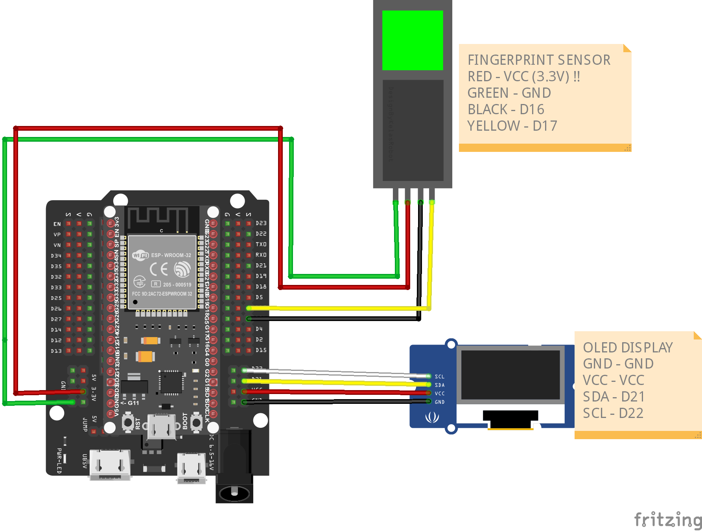

# IoT-Based Fingerprint Biometric Attendance (ESP32 + AS608)

Simple, demo-friendly FYP project:
- **ESP32 + AS608** optical fingerprint sensor
- **SSD1306 OLED** shows live status (e.g., `scanning.. Haikal enter`)
- **MQTT → Node-RED** logs to **CSV** on your Windows PC
- **Telegram** notification on every scan (optional but recommended)

---

## 1) Hardware

- ESP32 DevKit (USB)
- Optical fingerprint sensor (TTL UART)
- SSD1306 0.96" I²C OLED (128×64)
- Wires, USB cable

**Wiring**
- Sensor TXD → ESP32 **GPIO16** (RX2)  
- Sensor RXD → ESP32 **GPIO17** (TX2)  
- Sensor V+ → **5V** (recommended), GND → GND  
- OLED SDA → **GPIO21**, SCL → **GPIO22**, VCC → 3.3V, GND → GND


---

## 2) Windows 11 – Software setup (step-by-step)

### 2.1 Install Node.js (needed for Node-RED)
1. Download **Node.js LTS** from nodejs.org and install (default options).

### 2.2 Install Node-RED
```bash
npm install -g --unsafe-perm node-red
````

Run it:

```bash
node-red
```

Open the editor at **[http://127.0.0.1:1880](http://127.0.0.1:1880)**.

### 2.3 Install Mosquitto (MQTT broker)

1. Download Windows installer from mosquitto.org, install (default).
2. Save `broker/mosquitto.conf` from this repo to:

   ```
   C:\Program Files\mosquitto\mosquitto.conf
   ```
3. Start broker (PowerShell as Admin):

   ```powershell
   "C:\Program Files\mosquitto\mosquitto.exe" -v -c "C:\Program Files\mosquitto\mosquitto.conf"
   ```

   You should see: `Opening ipv4 listen socket on port 1883.`

> **Firewall:** Allow `mosquitto.exe` and inbound TCP **1883**.

### 2.4 ESP32 USB Drivers

* If your board uses **CP210x** or **CH340**, install the corresponding Windows driver (check Device Manager → Ports).
* After driver install, note the **COM port** of your ESP32.

### 2.5 Arduino IDE + ESP32 core

1. Install **Arduino IDE**.
2. File → Preferences → *Additional Boards Manager URLs*:

   ```
   https://raw.githubusercontent.com/espressif/arduino-esp32/gh-pages/package_esp32_index.json
   ```
3. Tools → Board Manager → install **esp32 by Espressif Systems**.
4. Select board **ESP32 Dev Module** (or your exact model) and the correct **COM port**.

### 2.6 Arduino libraries (Library Manager)

* **Adafruit Fingerprint Sensor Library**
* **Adafruit GFX Library**
* **Adafruit SSD1306**
* **PubSubClient** (by Nick O’Leary)

---

## 3) Enroll fingerprints (one-time)

Use either:

* The vendor **SFG Demo** tool (via USB-TTL) to enroll ID 1..N, **or**
* Your working **enroll** sketch (`firmware/esp32_enroll/esp32_enroll.ino`).

Make a note of each student’s **ID** (e.g., Ali → 1, Siti → 2).

---

## 4) Flash the ESP32 “attendance” firmware

Open `firmware/esp32_attendance/esp32_attendance.ino` and edit:

```cpp
const char* WIFI_SSID = "YOUR_WIFI_SSID";
const char* WIFI_PASS = "YOUR_WIFI_PASSWORD";

// PC's LAN IP (where Mosquitto/Node-RED run)
const char* MQTT_HOST = "192.168.1.23";   // <-- change this
const uint16_t MQTT_PORT = 1883;

IdName idmap[] = {
  {1, "Haikal"},
  {2, "Siti"},
  {3, "Ravi"},
};
```

Upload to the ESP32.
Serial Monitor should show `Fingerprint sensor OK` and template count.

OLED idle text: **“Scanning…”**
On match: **“scanning.. Ali enter  ID#1”** and it publishes a JSON to MQTT.

---

## 5) Node-RED flow (CSV logging + Telegram)

### 5.1 Import the flow

* Node-RED menu → **Import** → Clipboard → paste the contents of
  `node-red/flows/flow_attendance_csv_telegram.json` → **Import**.
* Install palette **`node-red-contrib-telegrambot`** if prompted.

### 5.2 Set CSV file path

Open the **File** node (“Append to CSV”) and set a valid Windows path, e.g.:

```
C:\Users\<yourname>\Documents\attendance.csv
```

Click **Deploy**.

Click **“Write CSV header (click once)”** inject node to create the header.

### 5.3 Telegram bot (optional, recommended)

1. In Telegram, talk to **@BotFather** → `/newbot` → copy the **bot token**.
2. Send any message (“hi”) to your bot to initialize it.
3. Get your `chat_id`: open
   `https://api.telegram.org/bot<YOUR_TOKEN>/getUpdates`
   and find `"chat":{"id":...}`.
4. In Node-RED, open the blue **Telegram sender** node:

   * Paste your **token**.
   * Set **chatId** to your number.
5. Deploy. Now each scan will also push a Telegram message.

> The flow writes CSV columns:
> `timestamp,local_time,device,name,finger_id,confidence,status,_received_at`

---

## 6) Run the demo

1. Start Mosquitto (`mosquitto -v -c ...`).
2. Start Node-RED (`node-red`) and open [http://127.0.0.1:1880](http://127.0.0.1:1880).
3. Power the ESP32.
4. Scan a finger:

   * OLED shows status and name.
   * Node-RED appends a row to `attendance.csv`.
   * Telegram pops a notification (if enabled).

---

## 7) Troubleshooting

* **ESP32 freezes after a scan** → You’re using a blocking MQTT connect. This repo uses **non-blocking** pumps so it won’t freeze.
* **CSV not updating** → Check File node path/permissions; ensure the flow is **Deployed**; confirm MQTT In topic `attendance/events`.
* **ESP32 not publishing** → Set `MQTT_HOST` to your PC’s **IPv4**, not `localhost`.
* **No Telegram** → Wire the Telegram branch **before** the CSV node (use the provided flow), confirm `chatId` is numeric and the bot token is correct.
* **Timezone off** → The device sends `+08:00` timestamps; flow also computes `local_time` using `Asia/Kuala_Lumpur`.

---

## 8) Project layout

* `firmware/esp32_attendance/esp32_attendance.ino` – main sketch (AS608/R307 + OLED + MQTT)
* `node-red/flows/flow_attendance_csv_telegram.json` – importable Node-RED flow
* `broker/mosquitto.conf` – minimal Windows broker config (listener 1883, anonymous)
* `node-red/csv/` – folder to keep your CSV (or use your Documents path)

---
